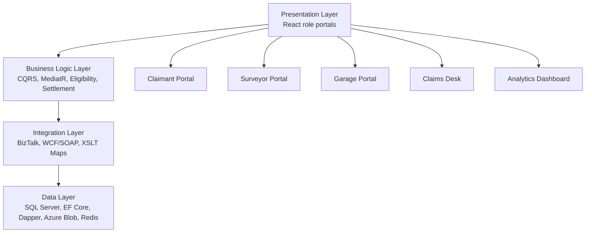

# Reliance General Insurance - Motor Claims Platform

Enterprise-style React 18 portfolio demo for a complete motor insurance claims ecosystem. The application is deployable on Vercel and uses hardcoded Indian insurance mock data, role-based portals, settlement calculations, workflow state changes, and management analytics.

## Live Demo Flow

1. Open the landing page and choose a portal.
2. Use **Claims Desk** to inspect claims, approve assessments, review documents, and run settlement calculations.
3. Use **Claimant Portal** to file a new FNOL claim and track its status.
4. Use **Surveyor Portal** to simulate field photo uploads, line-item decisions, and report submission.
5. Use **Garage Portal** to submit estimates, view cashless authorisations, and inspect payment status.
6. Use **Analytics Dashboard** to review KPIs, regional performance, ageing, and settlement charts.

## Tech Stack

- React 18 with Vite
- Material UI v5 and custom Reliance-themed palette
- React Router v6
- Recharts
- date-fns
- React Context + useState
- Static mock data only, no backend calls

## Architecture



## Local Setup

```bash
npm install
npm run dev
```

Build for production:

```bash
npm run build
```

Preview production build:

```bash
npm run preview
```

## Vercel Deployment

The repository includes `vercel.json` with a rewrite rule for React Router:

```json
{
  "rewrites": [{ "source": "/(.*)", "destination": "/" }]
}
```

Import the repo into Vercel, keep the default Vite settings, and deploy.

## Project Structure

```text
src/
  components/       Shared enterprise UI components
  context/          Global claim state and notifications
  data/             Mock claims, garages, surveyors, constants
  hooks/            UI helpers
  pages/            Role-based portals and pages
  utils/            Currency, date, settlement calculations
```

## Settlement Formula

The calculator follows:

```text
(Bill - Inadmissibles) x (1 - Depreciation Rate) - Excess
```

Cashless claims pay the garage after depreciation and collect excess plus inadmissibles from the customer at delivery. Reimbursement claims deduct the compulsory excess from the amount paid to the customer.

## Portfolio Notes

This demo is intentionally frontend-only, but it mirrors enterprise claims concepts recruiters can discuss in interviews: FNOL, eligibility, surveyor assignment, BizTalk-style orchestration, document review, estimate approvals, cashless authorisation, NEFT settlement, ageing reports, and executive analytics.
